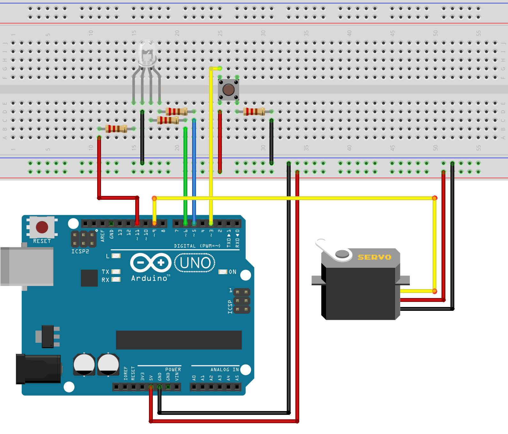

# Arduino
This project will need two boards Arduino Uno.
One of them is to control the touchscreen Adafruit ILI9341 where will be read morse code and a numeric pin, in differente phases.
The other one to control the Motor Servo - that opens or close a box - and the RGB Led.

## Material
* [Arduino Uno](https://store.arduino.cc/arduino-uno-rev3) x2
* [2.8" TFT LCD Adafruit ILI9341](https://www.adafruit.com/product/1651)
* Motor Servo
* RGBLed

## Software
The open-source Arduino Software (IDE) makes it easy to write code and upload it to the board.
This software can be used with any Arduino board. 
Refer to the [Getting Started](https://www.arduino.cc/en/Guide/HomePage) page for Installation instructions.

## Arduino Uno (One) - Adafruit ILI9341 
You have the file with the complete code to open and compile in the IDE. 
Then upload it to the board.
Don't forget to install the libraries necessary first.
The shield is fully assembled and ready to go. No wiring, no soldering! Simply plug it.

### Libraries
You can download the libraries necessary in the folder /libraries in this project.
Do not unzip the downloaded library, leave it as is.
In the Arduino IDE, navigate to Sketch > Include Library > Add .ZIP Library. 
At the top of the drop down list, select the option to "Add .ZIP Library".
You will be prompted to select the library you would like to add. 
Navigate to the .zip file's location and open it.

## Arduino Uno (Two) - Motor Servo - RGBLed 
You have the file with the complete code to open and compile in the IDE. 
Then upload it to the board.

### Wiring

## Authors

* **André Meira**

